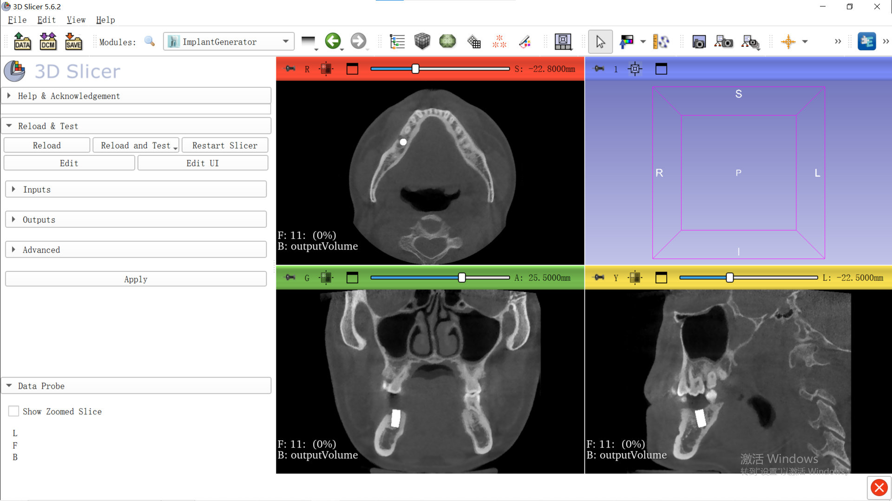

# SlicerImplantGenerator

ImplantGenerator is developed to use pretrained deep learning methods to automatically locate and generate virtual implants for missing teeth region.

The 3D Slicer Extension provide a easy-to-use tool for dentists.

## Acknowledgments

This method greatly benefits from [nnU-Net (Isensee, F et al.)](https://github.com/MIC-DKFZ/nnUNet). If you find our work useful, we encourage you to explore their work as well.

During the development of SlicerImplantGenerator, I found [The official documents of 3D Slicer](https://slicer.readthedocs.io/en/latest/developer_guide/extensions.html), [Slicer Wiki](https://www.slicer.org/wiki/Documentation/4.10/Training#Tutorials_for_software_developers) and [some online blogs](https://blog.csdn.net/CodeWorld1999/article/details/134740406) really useful. I am sincerely grateful for their contributions.